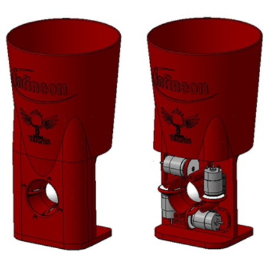
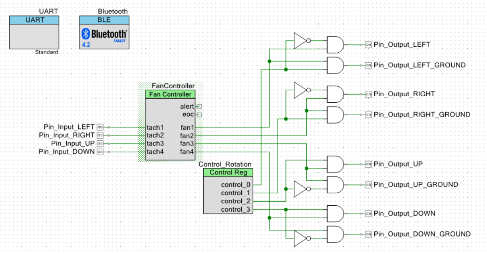
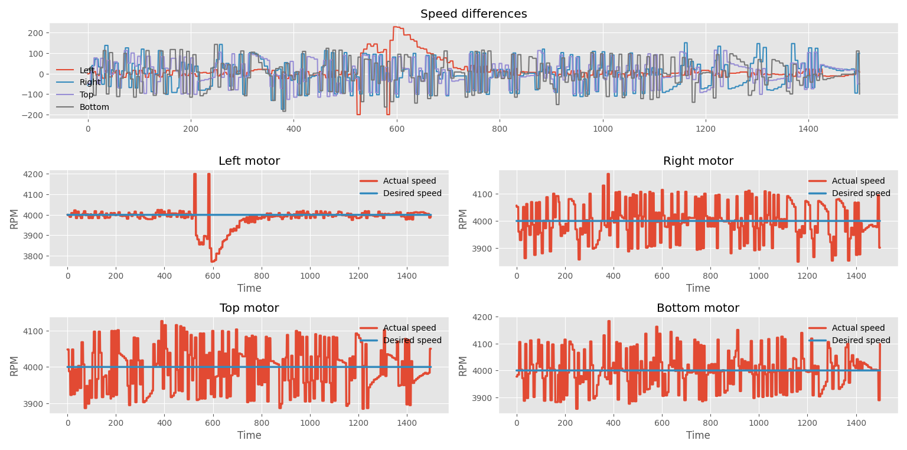
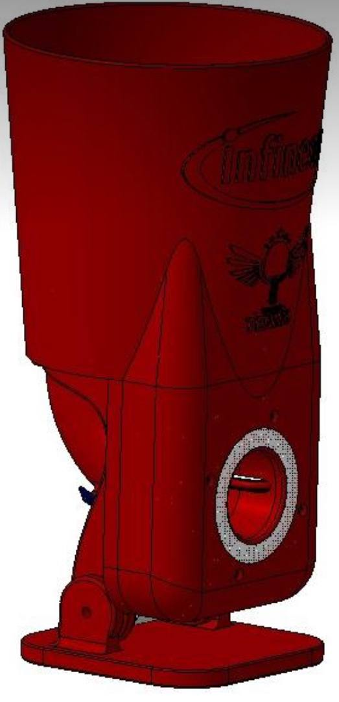

# CyberPong

## About the project

The purpose of that project is to create an Exercise Machine for effective trainings of table tennis. The is rotated with the motor. And is detected with light deflection filter. After that 4 motors pushes the balls. Having different motor speeds we can control spin directions and its angular speed.

## Project details:

- CPU Module used **PSOC 4200 BLE**
    - programed via _PSOC Creator_
    - scheme of out project

**Other Components**
1. PSOC 4200 BLE CY8CKIT-042-BLE-A
2. RoHS 18152522 R DC Motors
3. L298N Motor Driver (2 motors for each of them)
4. JGA25-370 DC Motow with a reducer
5. Light deflection sensor
6. 12V power supply

We used **PID Algorithm**  to make motor speeds as stable as possible. It was implemented with the built in **Fan Controller** Component in order to implement PID to get desired speed for the motor rotations and got appropriate results:

We can set speeds for the motors with UART interface or using Bluetooth, or set it directly from the code.

### Demonstration

## Our plans
- **Create a CyperPongApp to manage the Exercise Machine**
- **Add new rotation axis and other features in a new model**

- **Elaborate different training modes**
- **Test & Anylize & Improve  our machine**

### Contributors

- [Oleg Omelchuk](https://github.com/qLate)
- [Sviatoslav Lushnei](https://github.com/sviat-l)
- [Nazar Kononenko](https://github.com/romberol)
- [Bernikov Roman](https://github.com/nazar12314)
