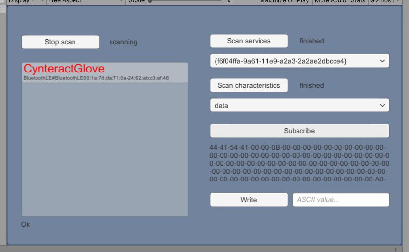

# UWP BLE packed as C++ winrt dll

To try it out in Unity, open the project "BleWinrtDll Unity" in Unity. Then start the scene "Assets/Scenes/Demo.scene".

This VisualStudio-project compiles to a C++-dll that can be imported into Unity. It wraps a part of the [UWP BLE API](https://docs.microsoft.com/de-de/windows/uwp/devices-sensors/bluetooth-low-energy-overview) inside a dll. The dll can be simply dropped into your Unity project and be used in the Unity Editor and the Windows standalone version.

The `Demo.scene` in this repo uses non-blocking calls to avoid creating Threads. I would recommend to use threads, though. After getting acquainted with the standard C# Thread API and after making sure you're closing all your threads `OnApplicationQuit` (Unity API) to avoid Unity Editor freezes, using them is the easier workflow for BLE in my opinion. You'll need less lines of code and you can have less latency. For a threaded version, you can try out [Joelx's Unity Ble Demo](https://github.com/Joelx/BleWinrtDll-Unity-Demo).

## Build

There is a prebuilt dll included in this repo, `BleWinrtDll Unity\Assets\BleWinrtDll.dll` or `DebugBle\BleWinrtDll.dll` (both are the same). But you can also build the dll yourself in VisualStudio. Follow these steps:

- Open the file BleWinrtDll.sln with VisualStudio (tested with Community 2019). You may be asked to install VisualStudio components when you open the project. The needed components are C++ Desktop and UWP, or if you want to save space, just the single components "MSVC C++ Buildtools", "Windows 10 SDK"/"Windows 11 SDK" (depending on your os), ".NET Framework 4.7.2 SDK".
- Choose configuration "Release" and "x64" (I think it must match your machine architecture).
- In the project explorer, right-click the project "BleWinrtDll" and choose "Compile".
- If you run into the error `wait_for is not a member of winrt::impl`, follow the steps on https://github.com/adabru/BleWinrtDll/issues/16 and leave a thumbs up. If enough thumbs accumulate, someone or me will try to make that more convenient.
- Wait until the compilation finishes successfully.

Now you find the file `BleWinrtDll.dll` in the folder `x64/Release`. You can copy this dll into your Unity-project. To try it out, you can also copy the file into the `DebugBle` folder (replacing the existing file) and start the DebugBle project. If your computer has bluetooth enabled, you should see some scanned bluetooth devices. If you modify the file `DebugBle/Program.cs` and change the device name, service UUID and characteristic UUIDs to match your specific BLE device, you should also receive some packages from your BLE device.

## Alternatives
[win32 Bluetooth API](https://docs.microsoft.com/en-us/windows/win32/api/_bluetooth/), as used by <https://github.com/DerekGn/WinBle> (thanks to david-sackstein).

[Bluetooth Framework](https://www.btframework.com/bluetoothframework.htm) by Soft Service Company. It is paid and you can get support. You also find answers on stackoverflow.

If you find more, you are welcome to report them, e.g. via opening an issue.

## Background

The Unity Editor is working with .NET-Framework but Microsoft's BLE API is only usable with .NET-Core. There is a C#-wrapper for .NET-Core functions, but these wrappers don't work in Unity for Unity-specific reasons. You can find some details in [this blog-post by Mike Taulty](https://mtaulty.com/2019/03/22/rough-notes-on-experiments-with-uwp-apis-in-the-unity-editor-with-c-winrt/). The blog-post also motivated me during the development of this dll.

As of now, [.NET 4.6 or .NET Standard 2.0 allows you to access the WinRT API from C\# in Unity, but only from the UWP and Xbox platforms.](https://docs.unity3d.com/Manual/windowsstore-scripts.html) When Unity switches over to .NET Core, the API should be accessible from other platforms as well. However, the Unity Editor always uses Mono. Therefore, you may always need a dll solution for editor testing. If you plan on using the WinRT API directly from C\# now through UWP/XBOX or in the future with .NET Core integration, know the dll's API is strongly leaned on Windows' own API. Actually, it is only a wrapper (plus some subtle thread handling). So doing so shouldn't be much work.

This project is based on [Microsoft's Bluetooth Low Energy sample](https://docs.microsoft.com/en-us/samples/microsoft/windows-universal-samples/bluetoothle/). It contains UWP and the corresponding C++-winrt code for every function that you find in this repo.

Furthermore I used the included 420-slide presentation on bluetooth low energy to get an understanding of what maximum throughput and latency can be achieved with BLE. I found it on the web but don't know the author.
